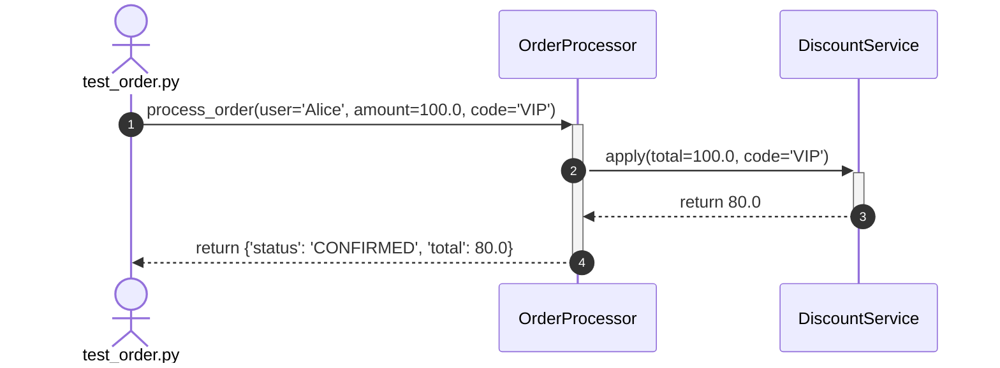

# Architecture Doc Plugin (v2.2.0)

[](LICENSE)

A production-grade automated codebase documentation, architecture visualization, and runtime execution tracing plugin for Claude Code.

Extract real AST module dependency graphs, trace test execution flows into interactive Mermaid sequence diagrams (`/trace-flow`), resolve TypeScript path aliases (`@/*`), discover REST API endpoints deterministically, generate validated Mermaid.js diagrams, export interactive HTML browser previews, and automate documentation freshness with pre-commit hooks.

---

## ⚡ 60-Second Quickstart

### 1. Install Plugin
```bash
# Add the marketplace repository (from GitHub or local path):
claude plugin marketplace add SanjayR857/architecture-doc-plugin

# Install the plugin (user or project scope):
claude plugin install architecture-doc-plugin --scope user
# (For Docker containers or CI, use: claude plugin install architecture-doc-plugin --scope project)
```

### 2. (Optional, Recommended) Enable Bundled MCP Server
The plugin includes a dedicated AST code analysis and runtime execution tracer MCP server:
```bash
# Install lightweight dependencies
pip install -r mcp/requirements.txt

# Register MCP server with Claude Code
claude mcp add doc-tools --scope user -- python mcp/doc_mcp_server.py
```

### 3. Immediate Usage on Any Repository
```bash
# Trace any test case and visualize its call flow as a sequence diagram:
/trace-flow pytest tests/test_order.py

# Generate architecture diagram for your current project:
/gen-diagram

# Scan and document all REST endpoints:
/api-spec

# Deep-dive into any complex file:
/explain-file path/to/any/file.py
```

---

## 📦 What's Included

```
architecture-doc-plugin/
├── .claude-plugin/
│   ├── marketplace.json                # Marketplace registry catalog
│   └── plugin.json                     # Plugin manifest (v2.2.0)
├── commands/
│   ├── trace-flow.md                   # Runtime test tracer & Mermaid sequence diagram generator
│   ├── gen-diagram.md                  # Mermaid diagram generator + syntax validation & HTML preview
│   ├── api-spec.md                     # Deterministic REST endpoint scanner (Markdown & OpenAPI 3.0)
│   ├── explain-file.md                 # Deep file breakdown (structure, dependencies, logic, gotchas)
│   └── doc-setup.md                    # Setup wizard for bundled MCP tools
├── mcp/
│   ├── doc_mcp_server.py               # AST dependency parser, TS alias resolver, route extractor, tracer tool
│   ├── tracer.py                       # Zero-dependency sys.settrace execution recorder
│   └── requirements.txt                # Minimal Python dependencies (mcp>=1.0.0)
├── examples/
│   └── hooks.json                      # Drop-in automation hooks template
├── docs/
│   └── hooks-examples.md               # Ready-to-use hooks recipes
└── skills/
    └── codebase-documentation/
        └── SKILL.md                    # Comprehensive documentation engineering standards
```

---

## 🛠️ Commands

| Command | Description | MCP-Enhanced Mode |
|---|---|---|
| `/trace-flow [test_or_script]` | Traces runtime execution and generates sequence diagrams + narrative | Runs zero-dependency tracer, records calls/args/returns, builds nested sequence diagram, and exports HTML preview |
| `/gen-diagram [dir or type]` | Generates Mermaid.js diagrams (Flowchart, Sequence, Class) | Uses real AST parsing + TypeScript alias resolution, validates syntax, and exports interactive HTML preview |
| `/api-spec [dir or format]` | Generates Markdown or OpenAPI 3.0 YAML specs | Scans route decorators deterministically across FastAPI, Flask, Express, Hono |
| `/explain-file <file_path>` | Creates an onboarding breakdown of complex source files | Inspects inbound and outbound coupling using the project dependency graph |
| `/doc-setup` | Wizard to install dependencies and register the bundled MCP server | Checks environment and connects `doc-tools` to Claude Code |

---

## 🔌 Bundled MCP Server (`mcp/doc_mcp_server.py`)

The included MCP server provides 5 deterministic tools:

1. `trace_execution` — Runs any Python test case or script under trace mode. Records chronological function calls, arguments, and return values, emitting a clean Mermaid sequence diagram with activation lifelines and HTML preview.
2. `parse_dependencies` — AST parsing for Python and token parsing for JS/TS/Go. Supports `tsconfig.json` path mapping (`@/*`), identifies circular dependencies, and computes architectural coupling without fragile regex pipelines.
3. `extract_api_routes` — Discovers HTTP endpoints, route paths, handlers, docstrings, and parameters across FastAPI, Flask, Express, and Hono.
4. `validate_mermaid` — Checks Mermaid syntax for unquoted parentheses, unclosed subgraphs, and invalid arrow tokens to guarantee zero-error rendering.
5. `export_html_preview` — Generates a self-contained HTML page with embedded Mermaid.js, zoom/pan controls, and print/PDF export at `docs/architecture-preview.html`.

Run the self-test locally anytime:
```bash
python mcp/doc_mcp_server.py --test
```

---

## 🔍 Execution Flow Tracing (`/trace-flow`)

Debugging complex test cases or unfamiliar workflows by reading line-by-line is slow and error-prone. The `/trace-flow` command runs your test or Python script under a zero-dependency runtime tracer and automatically converts the execution path into a **Mermaid.js sequence diagram**, an **interactive HTML preview**, and a **step-by-step narrative**.

### 1. Universal Test Framework Support

Supports both **`unittest`** and **`pytest`** seamlessly:

```bash
# Run with Python standard unittest (zero external packages required)
/trace-flow python -m unittest tests/test_order.py
/trace-flow python tests/test_calculator.py

# Run with pytest (in any environment with pytest installed)
/trace-flow pytest tests/test_checkout.py
/trace-flow pytest tests/test_order.py::test_discount_flow

# Run any standalone Python script
/trace-flow python scripts/seed_database.py
```

### 2. Smart Noise Filtering

Standard test runners create hundreds of internal library calls (`_pytest`, `pluggy`, `unittest.runner`, `importlib`, `site-packages`). The tracer **automatically filters out framework noise**, recording exclusively your workspace application services, models, and test classes.

### 3. What You Get

#### A. Numbered Mermaid Sequence Diagram
Depicts true nested function activation lifelines (`+` / `-`), normal returns (`-->>`), and exceptions (`--x`):



#### B. Plain-English Execution Narrative
Translates raw function calls into a clear, chronological story:
- **Step 1:** `test_order.py` triggers `OrderProcessor.process_order` with `user='Alice'`, `amount=100.0`, `code='VIP'`.
- **Step 2:** `OrderProcessor` delegates to `DiscountService.apply` to evaluate the `'VIP'` discount rule.
- **Step 3:** `DiscountService` calculates 20% off and returns `80.0`.
- **Step 4:** `OrderProcessor` returns confirmed order state.

#### C. Variable & State Snapshot Table
Inspect parameters, return values, and caller/callee relations:

| Step | Caller | Target Function | Key Inputs | Return / Exception |
|:----:|:-------|:----------------|:-----------|:-------------------|
| 1 | `test_order.py` | `OrderProcessor.process_order` | `user='Alice', amount=100.0, code='VIP'` | `{'status': 'CONFIRMED'}` |
| 2 | `OrderProcessor` | `DiscountService.apply` | `total=100.0, code='VIP'` | `80.0` |

#### D. Interactive Browser Preview (`docs/trace-preview.html`)
Double-click to open in any web browser with pan, zoom, copy-to-clipboard, and print-to-PDF capabilities.

---

## 🪝 Automated Hooks (`examples/hooks.json`)

Copy `examples/hooks.json` to `.claude/hooks.json` in your repository:

- 🔄 **Auto-diagram on architecture changes**: Automatically regenerates diagrams when files in `services/`, `models/`, or `routes/` are modified.
- 📜 **Auto-spec on route changes**: Keeps API documentation up-to-date whenever route handlers change.
- 🛡️ **Pre-commit freshness gate**: Ensures architecture documentation exists and is current before code is committed.

---

## License

MIT © [SanjayR857](https://github.com/SanjayR857)
