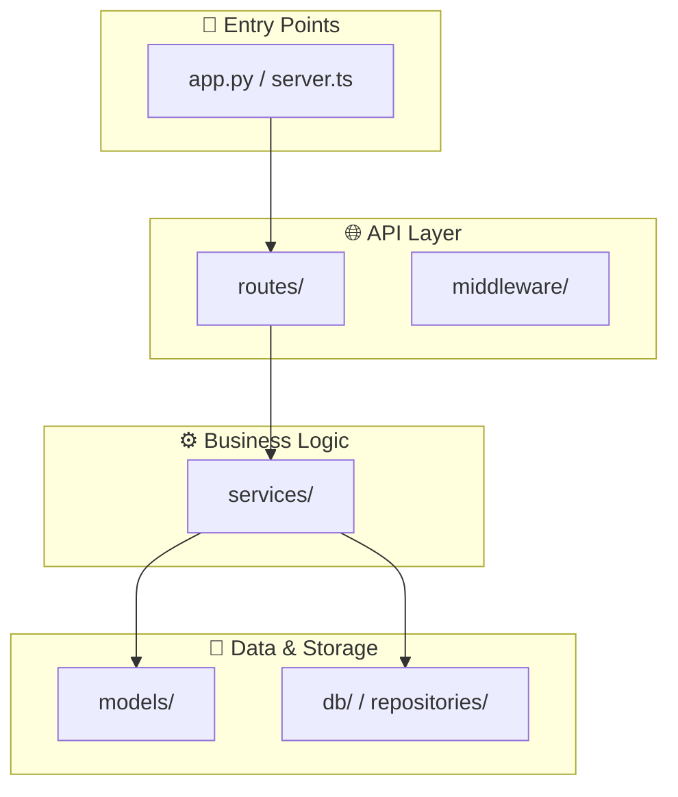
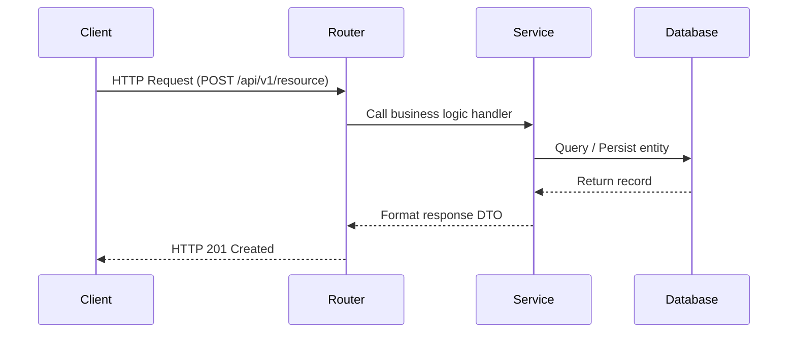

# Generate Architecture Diagram

Analyze the codebase's module dependencies and generate a Mermaid.js diagram with optional interactive HTML preview.

## Your Task

Scan the repository structure, identify module dependencies, validate Mermaid syntax, and produce an architecture diagram.

**Arguments**: `$ARGUMENTS` (can be empty, a directory path, or diagram style like `sequence` or `class`)

---

## Step 1: Detect Mode (MCP vs. File Scanning)

Check if the `doc-tools` MCP server is connected:

### If MCP is Available (`mcp__doc__parse_dependencies`):
1. Resolve the target directory (default: `.` or `$ARGUMENTS` if pointing to a directory).
2. Call `mcp__doc__parse_dependencies`:
   ```json
   { "directory": "[target_dir]", "file_types": "py,ts,js,go" }
   ```
3. Use the returned JSON which includes:
   - `total_files_analyzed` and `total_dependencies_found`
   - `layers`: `routes`, `services`, `models`, `db`, `utils`, `core`
   - `edges`: exact directed imports
   - `circular_dependencies`: list of detected cycles
   - `coupling`: in-degree and out-degree per module

### If MCP is Not Available:
Fall back to native Claude Code tools (`Glob`, `Grep`, `Read`):
1. Search for project configuration files using `Glob`: `**/package.json`, `**/pyproject.toml`, `**/Cargo.toml`, `**/go.mod`.
2. Discover source files using `Glob`: `**/*.{ts,tsx,js,jsx,py,go,rs,java}` (ignoring `node_modules/`, `.git/`, `venv/`, `dist/`).
3. Scan imports using `Grep`:
   - Python: `import `, `from `
   - JavaScript/TypeScript: `import .* from`, `require(`
   - Go: `import (`

---

## Step 2: Choose Diagram Type

Based on `$ARGUMENTS`, select the diagram format:

### Option A: Flowchart (Default — Architecture & Module Dependencies)
Best for showing how layers and modules communicate:



### Option B: Sequence Diagram (Best for Request/Response Flow)
Use when `$ARGUMENTS` contains `sequence`, `flow`, or `request`:



### Option C: Class Diagram (Best for OOP/Entity Models)
Use when `$ARGUMENTS` contains `class` or `oop`.

---

## Step 3: Validate Diagram Syntax

Before presenting the diagram, ensure it will not fail in GitHub, Notion, or Mermaid renderers:

1. **Quote all labels containing special characters**:
   - ❌ `AUTH[Auth Service (JWT)]`
   - ✅ `AUTH["Auth Service (JWT)"]`
2. **Check subgraph closure**: Every `subgraph` must have a matching `end`.
3. **If MCP is available**: Call `mcp__doc__validate_mermaid` to verify syntax and auto-fix any formatting issues:
   ```json
   { "diagram_code": "[generated_mermaid_code]" }
   ```

---

## Step 4: Export Interactive HTML Preview (Optional/MCP)

If MCP `mcp__doc__export_html_preview` is available:
Call the tool to generate a self-contained HTML preview:
```json
{
  "diagram_code": "[validated_mermaid_code]",
  "title": "System Architecture Diagram",
  "output_path": "docs/architecture-preview.html"
}
```
Report the generated preview link so the user can open it in their browser.

---

## Step 5: Present the Output

```
╔══════════════════════════════════════════════════════════════╗
║              ARCHITECTURE DIAGRAM                           ║
║  Target: [directory or project]                             ║
║  Type: [flowchart/sequence/class]                           ║
║  Modules detected: [count]                                  ║
║  Dependencies mapped: [count]                               ║
╚══════════════════════════════════════════════════════════════╝
```

Output the Mermaid diagram in a fenced code block:

````markdown
```mermaid
[generated diagram code]
```
````

### Architectural Observations:
- **Core Hub**: Module with highest in-degree coupling.
- **Dependency Flow**: Confirm clean unidirectional flow (e.g. Routes → Services → DB).
- **Circular Dependencies**: Report any detected circular import loops.
- **Interactive Preview**: Link to `docs/architecture-preview.html` if generated.

---

## Step 6: Next Steps

- "Generate API documentation for these endpoints: `/api-spec`"
- "Deep-dive into a critical file: `/explain-file path/to/file`"
- "View interactive preview in browser: open `docs/architecture-preview.html`"
