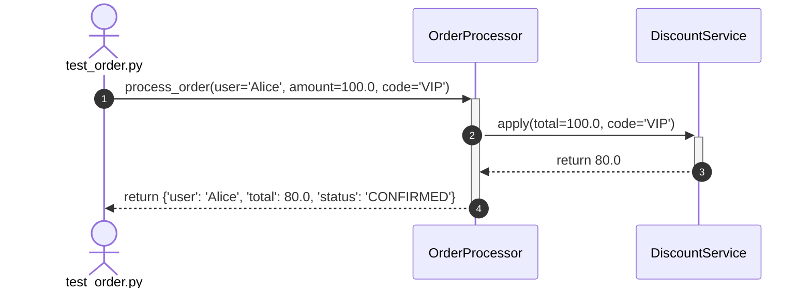

# Trace Execution Flow

Execute any Python test case, script, or pytest target in runtime trace mode to automatically record function calls, input arguments, return values, and exceptions. Produces an exact Mermaid.js sequence diagram, an interactive HTML preview, a headless vector SVG export, and a plain-English explanation of the execution workflow.

## Your Task

1. Determine the target test command or script from `$ARGUMENTS`.
2. Execute the test under the zero-dependency execution tracer.
3. Generate:
   - A numbered **Mermaid Sequence Diagram** with activation lifelines.
   - A **Plain-English Narrative** explaining the workflow step by step.
   - A **Variable & State Table** capturing inputs, outputs, and return values.
   - An **Interactive HTML Preview** for zoomable browser inspection.
   - A **Direct Headless Vector SVG File** (`docs/trace.svg`) on disk without requiring browser launch.

**Arguments**: `$ARGUMENTS` (e.g., `pytest tests/test_order.py`, `python test_cart.py`, or `test_checkout.py`)

---

## Step 1: Resolve Target

If `$ARGUMENTS` is provided:
- Use it directly as the execution command (e.g., `pytest tests/test_order.py`, `python test_cart.py`).

If `$ARGUMENTS` is empty:
- Use `Glob` to discover test files in the workspace: `tests/**/test_*.py`, `test_*.py`, `**/*_test.py`.
- If a test file is found, suggest running it or pick the primary test file.
- If no test file is found, ask the user: *"Please specify the test command or Python script to trace, e.g.: `/trace-flow pytest tests/test_order.py`"*.

---

## Step 2: Execute Trace

### Method A: Via MCP Server (Recommended)
Call the `mcp__doc__trace_execution` tool:

```json
{
  "command": "$ARGUMENTS",
  "working_dir": ".",
  "max_depth": 8,
  "max_events": 300,
  "export_html": true,
  "export_svg": true,
  "svg_path": "docs/trace.svg"
}
```

The tool returns:
- `calls`: Chronological function execution records with arguments and return values.
- `mermaid_diagram`: Clean Mermaid sequence diagram.
- `narrative`: Step-by-step flow explanation.
- `html_preview_url`: Local file URI to the interactive browser preview.
- `svg_file_path`: Path to the exported standalone vector SVG file.
- `total_events` and `duration_ms`: Performance metrics.

### Method B: Via CLI (Direct Headless SVG Export)
If the MCP server is not active, execute the bundled tracer directly from terminal:

```bash
# Dump vector SVG directly to disk without browser:
python mcp/tracer.py --workspace . --export-svg docs/trace.svg --output docs/trace.json $ARGUMENTS
```

Then read `docs/trace.json` to extract the timeline and sequence diagram.

---

## Step 3: Present Results

Output the analysis in the following structured format:

### 1. ⏱️ Execution Overview
- **Target**: `$ARGUMENTS`
- **Total Function Calls Traced**: `N`
- **Execution Duration**: `X.XX ms`
- **Status**: ✅ Passed (or ❌ Exception / Failure)

### 2. 📊 Visual Sequence Diagram
Render the Mermaid sequence diagram inside a standard ````mermaid` block:



### 3. 📖 Plain-English Execution Story
Explain the flow in clear, narrative language so the user can understand how the code behaves without reading source files line-by-line:
- **Trigger**: What initiated the test or execution?
- **Workflow Journey**: How did control flow through different classes and services?
- **Decision Branches**: What conditions or validations were evaluated?
- **Outcome**: What final state, return value, or assertion concluded the flow?

### 4. 📋 Function Call Snapshot Table
| Step | Caller | Target Function | Key Inputs | Return / Exception |
|:----:|:-------|:----------------|:-----------|:-------------------|
| 1 | `test_order.py` | `OrderProcessor.process_order` | `user='Alice', amount=100.0, code='VIP'` | `{'status': 'CONFIRMED'}` |
| 2 | `OrderProcessor` | `DiscountService.apply` | `total=100.0, code='VIP'` | `80.0` |

### 5. 🌐 Interactive Browser Preview
Provide the clickable link to the generated HTML preview:
- `docs/trace-preview.html`
- Instruct the user that they can open this file in any browser to pan, zoom, and inspect the sequence diagram visually.

### 6. 🎨 Direct Headless Vector SVG Export
Provide the path to the standalone vector SVG file:
- `docs/trace.svg`
- Clean, standalone SVG vector format ready to embed directly into Markdown, GitHub wikis, Notion, or slides without needing to launch a web browser.
