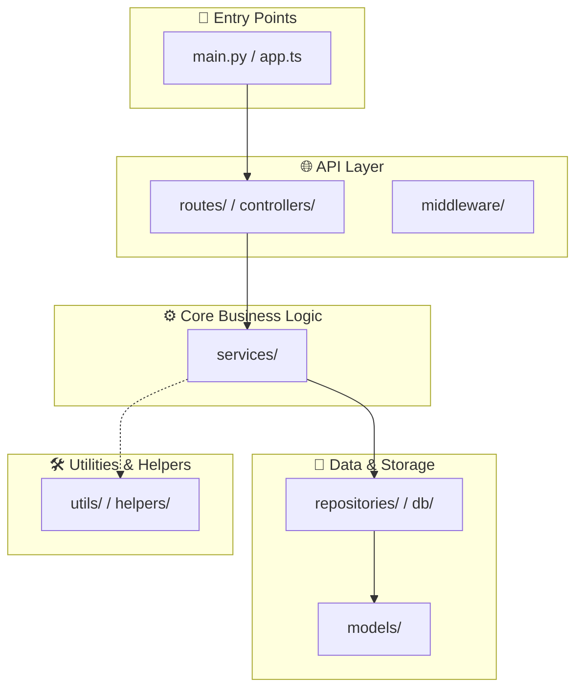

# Architecture Diagramming & AST Dependency Analysis Playbook

A comprehensive guide for extracting real AST module dependency graphs, identifying architectural layers, calculating coupling metrics, validating Mermaid syntax, and generating interactive HTML previews.

---

## 1. AST Analysis vs. Regex Guessing

Never use regular expressions to guess imports across multi-line or dynamic codebases. Always use AST-level parsing or the bundled `parse_dependencies` tool:

| Aspect | Regex Guessing | AST Dependency Engine (`mcp__doc__parse_dependencies`) |
|---|---|---|
| Multi-line imports (`from foo import (\n a, b\n)`) | ❌ Often breaks | ✅ True abstract syntax tree |
| TypeScript Path Aliases (`@/services/auth`) | ❌ Unresolved raw strings | ✅ Resolves paths via `tsconfig.json` `paths` |
| Circular Dependencies (`A -> B -> A`) | ❌ Cannot detect | ✅ Tarjan's strongly connected components algorithm |
| Coupling Metrics (In/Out Degree) | ❌ Inaccurate | ✅ Exact incoming and outgoing dependency counts |

---

## 2. Standard Architectural Layers

When constructing module dependency diagrams, cluster nodes into clear logical subgraphs:

---

## 3. Bulletproof Mermaid Syntax Rules

LLM-generated Mermaid diagrams frequently crash rendering engines (GitHub, Notion, Obsidian) due to unquoted punctuation. Strictly enforce:

### Rule 1: Always Quote Parentheses in Node Labels
- ❌ Broken: `A[Auth (JWT)] --> B[Database]` *(Crashes Mermaid parser!)*
- ✅ Valid: `A["Auth (JWT)"] --> B["Database"]`

### Rule 2: Subgraph Balance
Every `subgraph Name["Title"]` MUST have an exact matching `end`. Mismatched counts will fail compilation.

### Rule 3: Valid Arrow Semantics
- `-->` : Direct synchronous import or function call
- `-.->` : Optional dependency, utility call, or event emission
- `==>` : Primary request pipeline or critical data path

### Rule 4: Diagram Size Limits
- If a diagram exceeds 15–20 modules, partition it into layer-specific diagrams (e.g., API Layer Diagram, Domain Service Diagram) to maintain readability.

---

## 4. MCP Tools Reference

1. **`mcp__doc__parse_dependencies`**:
   - Analyzes `.py`, `.ts`, `.js`, `.go` files.
   - Extracts module lists, edges, circular loops, and architectural coupling.
2. **`mcp__doc__validate_mermaid`**:
   - Lints diagram code.
   - Automatically wraps unquoted parentheses and verifies subgraph matching.
3. **`mcp__doc__export_html_preview`**:
   - Generates `docs/architecture-preview.html` with zoom, pan, copy code, and print-to-PDF buttons.
4. **`mcp__doc__export_svg`**:
   - Directly renders Mermaid code into a standalone, crisp vector `.svg` file on disk without opening a browser. Ideal for CI pipelines, README embeds, and markdown documents.
