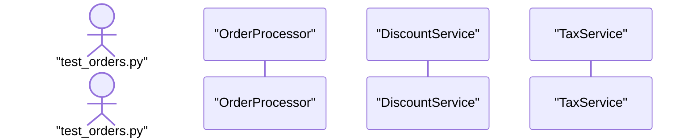
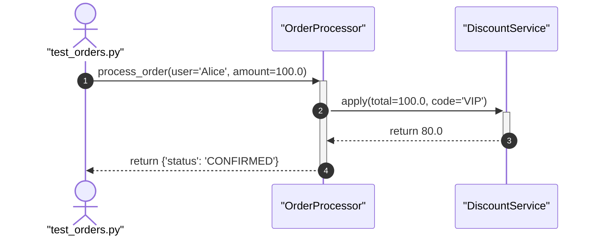

# Runtime Execution Tracing & Sequence Visualizer Playbook

An expert guide for tracing dynamic code execution, recording runtime function lifecycles, and transforming complex test runs into clean, readable Mermaid sequence diagrams and plain-English narratives.

---

## 1. When to Use Execution Tracing

Static code reading has severe blind spots: dynamic dispatch, inheritance overrides, dependency injection, and complex conditional branches cannot easily be understood by reading source files in isolation.

| Scenario | Static Analysis (`/gen-diagram`) | Runtime Tracing (`/trace-flow`) |
|---|---|---|
| Understanding system module coupling | ✅ Best | ❌ Too granular |
| Debugging why a specific test case fails | ❌ Static blind spots | ✅ Exact runtime call path |
| Verifying argument values passed between services | ❌ No runtime values | ✅ Exact parameter snapshots |
| Understanding the execution order of a feature flow | ⚠️ Inferred / guessed | ✅ Exact chronological sequence |
| Capturing exceptions and failure points | ❌ Cannot trace runtime errors | ✅ Pinpoints exact throw location |

---

## 2. Zero-Dependency Tracer Architecture

The bundled tracer (`mcp/tracer.py`) uses Python's standard library `sys.settrace` with **zero external dependencies**.

### Smart Noise Filtering
To prevent diagrams from being flooded with hundreds of internal framework lines, the tracer automatically suppresses:
- Python internal modules: `importlib`, `encodings`, `<frozen>`, `<string>`
- Package directories: `site-packages`, `dist-packages`
- Test framework internals: `_pytest`, `pluggy`, `py._`
- Standard library runners: `unittest/case.py`, `unittest/runner.py`, `unittest/suite.py`

**What is recorded**: Exclusively user application code, services, models, and test functions inside the project workspace.

---

## 3. Supported Test Frameworks & Execution Patterns

### A. Python `unittest` (Built-in)
Works out of the box in every Python environment without third-party packages:
```bash
# Tracing via unittest module
/trace-flow python -m unittest tests/test_orders.py

# Tracing a standalone script with unittest.main()
/trace-flow python tests/test_orders.py

# Tracing a test discovery pattern
/trace-flow python -m unittest discover -s tests
```

### B. `pytest`
Supported in any environment where `pytest` is installed:
```bash
# Tracing an entire test file
/trace-flow pytest tests/test_checkout.py

# Tracing a specific test function or method
/trace-flow pytest tests/test_checkout.py::test_vip_discount

# Tracing with keyword filtering
/trace-flow pytest -k "test_payment"
```

### C. Arbitrary Python Scripts
Any standalone script or entrypoint can be traced:
```bash
/trace-flow python scripts/seed_database.py
/trace-flow python -c "from services.cart import Cart; Cart().checkout()"
```

---

## 4. Mermaid Sequence Diagram Standards

When generating sequence diagrams from runtime traces, strictly adhere to these rules:

### A. Numbering & Aliasing
Always start with `autonumber` and define participant aliases to avoid syntax errors with filenames, spaces, or hyphens:


### B. True Nested Activation Lifelines
Use `+` on call arrows to activate the callee lifeline, and `-` on return/exception arrows to deactivate:


### C. Distinguish Normal Returns vs. Exceptions
- **Normal Return**: Use dashed line with open arrow: `Callee-->>-Caller: return <value>`
- **Exception Raised**: Use error cross arrow (`--x`): `Callee--x-Caller: Raises ValueError('Limit exceeded')`

### D. Parameter & Return Value Truncation
Never include multi-kilobyte JSON payloads in diagram message labels. Truncate long strings to ~40 characters:
- `process_order(user='Alice', code='VIP')`
- `return {'status': 'OK', ... (4 keys)}`

---

## 5. Structuring Trace Explanations

Whenever presenting trace output to developers, provide the **Four-Pillar Report**:

1. **⏱️ Execution Header**: Target command, call count, duration in ms, and pass/fail state.
2. **📊 Visual Sequence Diagram**: The clean, validated Mermaid diagram.
3. **📖 Plain-English Story**:
   - What initiated the execution?
   - How did control flow between services?
   - What business decisions or branches were taken?
   - What was the final result or assertion?
4. **📋 State Snapshot Table**:
   | Step | Caller | Target Function | Key Inputs | Return / Exception |
   |:----:|:-------|:----------------|:-----------|:-------------------|
   | 1 | `test_orders.py` | `OrderProcessor.process` | `user='Alice'` | `{'status': 'PAID'}` |
5. **🌐 Interactive HTML Link**: Direct clickable file link to `docs/trace-preview.html`.
